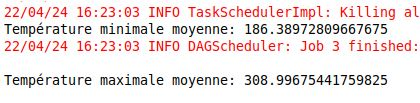
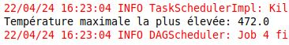
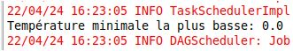
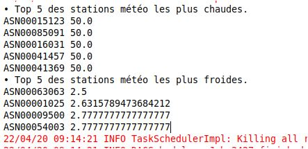

### Assignment

Exercice 3 :
Nous souhaitons, dans cet exercice d’analyser les données météorologiques
fournies par NCEI (National Centers for Environmental Information) à l'aide de
Spark.

Le jeu de données est mis à la disposition du public par le NCEI. L'ensemble de
données séparé par année peut être téléchargé à partir du lien suivant : Index of
/pub/data/ghcn/daily/by_year (noaa.gov).

L'ensemble de données contient les attributs ID, date, element, value, m-flag, q-
flag, s-flag et OBS-TIME. Vous trouverez ci-dessous des informations sur ses

attributs.
• ID = 11-character station identification code
• YEAR/MONTH/DAY = 8-character date in YYYYMMDD format (e.g. 19860529 =
May 29, 1986)
• ELEMENT = 4-character indicator of element type
• DATA VALUE = 5-character data value for ELEMENT
• M-FLAG = 1-character Measurement Flag
• Q-FLAG = 1-character Quality Flag
• S-FLAG = 1-character Source Flag
• OBS-TIME = 4-character time of observation in hour-minute format (i.e. 0700 =7:00
am)
Afficher les statistiques suivantes pour 2020 :
• Température minimale moyenne.
• Température maximale moyenne.
• Température maximale la plus élevée.
• Température minimale la plus basse.
• Top 5 des stations météo les plus chaudes.
• Top 5 des stations météo les plus froides.

### Resultat

• Température minimale moyenne.
• Température maximale moyenne.

• Température maximale la plus élevée.

• Température minimale la plus basse.

• Top 5 des stations météo les plus chaudes.
• Top 5 des stations météo les plus froides.

